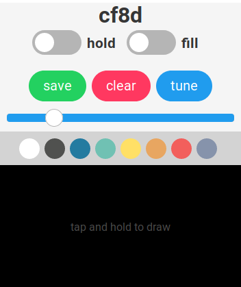

<h1>
  
  <a href="http://brushstroke.brockmcelroy.com">Brushstroke</a>
</h1>

Paint your screen with your phone! Check it out [here](http://brushstroke.brockmcelroy.com)

Open Brushstroke on your desktop or laptop, and your phone.
Point your phone at the center of the screen, and enter the room code from your desktop.
Now you are connected and ready to paint!

> Protip: Use the `tune` button to better calibrate Brushstroke to your devices.

## Features

- Live connection between screen and phone using WebSockets with Action Cable
- Calibrate to your phone, display size, and distance with only four taps
- Smooth lines using [quadratic curves](perfectionkills.com/exploring-canvas-drawing-techniques/#bezier-curves)
- Save the images you create

## Development & Deployment

Prerequisite: set up [Postgres.](https://www.digitalocean.com/community/tutorials/how-to-setup-ruby-on-rails-with-postgres)

1. Clone this repository:
  
        $ git clone

2. Install dependencies:

        $ cd castaway

        $ bundle install

        $ yarn install

3. Set up database:

        $ rails db:setup

    Or when deploying to Heroku:

        $ rails db:migrate

        $ rails db:seed

4. Run server:

        $ rails server
        
## Todo

- Periodically remove old rooms ([Heroku Scheduler](https://devcenter.heroku.com/articles/scheduler))
- Add support for multiple painters in one room
