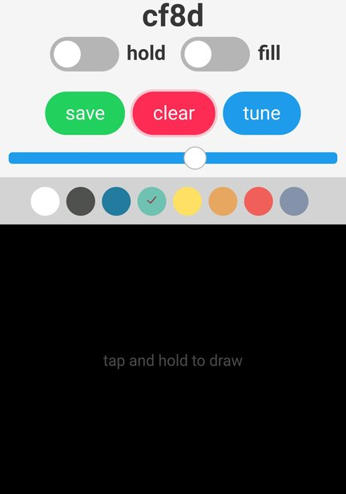

<h1 align="center">
  
</h1>

# [Brushstroke]()

Paint your screen with your phone! 

Open Brushstroke on your desktop or laptop, and your phone.
Point your phone at the center of the screen, and enter the room code from your desktop.
Now you are connected and ready to paint!

> Protip: Use the `tune` button to better calibrate Brushstroke to your devices.

## Development & Deployment

Prerequisite: set up [Postgres.](https://www.digitalocean.com/community/tutorials/how-to-setup-ruby-on-rails-with-postgres)

1. Clone this repository:
  
        $ git clone

2. Install dependencies:

        $ cd castaway

        $ bundle install

        $ yarn install

3. Set up database:

        $ rails db:setup

    Or when deploying to Heroku:

        $ rails db:migrate

        $ rails db:seed

4. Run server:

        $ rails server

To drop the production database and reseed:

        $ heroku pg:reset DATABASE_URL
        $ heroku run rails db:migrate
        $ heroku run rails db:seed

